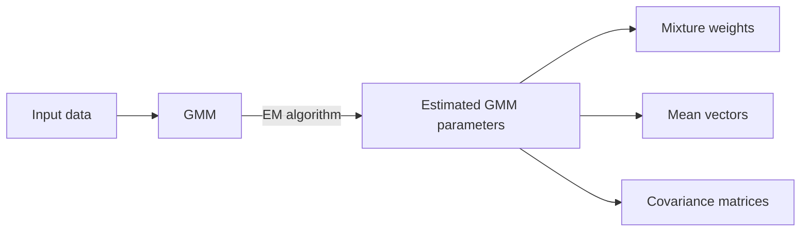
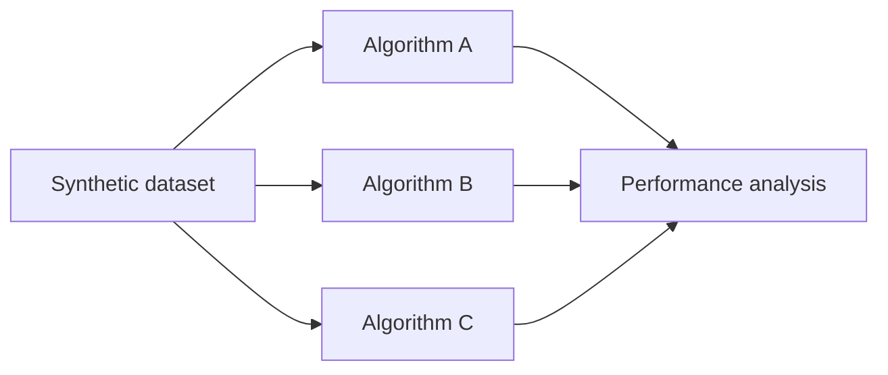

# Synthetic Data Generator

Gaussian Mixture Models (GMM) consist of a method of statistical analysis whose development dates back to Pearson's initial idea (1894) of fitting a mixture of two univariate normal components to a set of measurements of crabs.

## GMM fitting: data → model

Beyond obtaining clusters from univariate or multivariate normal components through the Expectation–Maximization (EM) algorithm, GMM can also be employed for sampling synthetic data.

## GMM sampling: model → data

---

# How GMM work?

A GMM assumes that a dataset is generated from a combination of several gaussian (normal) distributions, each representing a latent group or cluster.

Each component is defined by three elements:
- a **mixture weight** (the proportion of data belonging to the cluster);
- a **mean vector** (the cluster center); and
- a **covariance matrix** (the cluster shape and dispersion).

During model fitting, the EM algorithm iteratively estimates these parameters by alternating between assigning probabilities of cluster membership to each data point (E step) and updating the model parameters to maximize the likelihood of the data (M step).

---

# The purpose of this repository

Datasets containing clusters with known gaussian distribution structures can be very useful for comparing the performance of different algorithms in identifying clusters and their typical or most representative samples, which can be done by clustering quality metrics.

## Example of synthetic data usage

Given that, this repository aims to provide a framework for assessing data representativeness by applying and comparing clustering and decision-making algorithms under controlled and reproducible conditions.